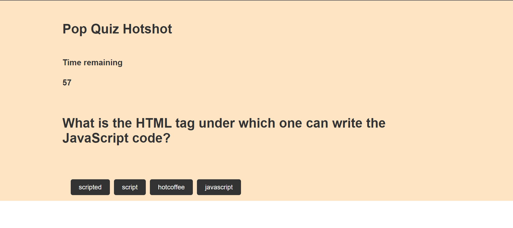

# PopQuizHotshot

## Description: 

This is a code quiz game. The goal is to answer as many questions correctly as possible before the timer runs out. If you answer a question incorrectly, time will be subtracted from the clock. The game is over when all questions have been answered or the timer reaches 0. At the end of the game, you can save your initials and score.

## How to play:

1. Click the "Start" button to start the game.
2. Answer the questions that appear on the screen.
3. If you answer a question correctly, you will be presented with the next question.
4. If you answer a question incorrectly, time will be subtracted from the clock.
5. The game is over when all questions have been answered or the timer reaches 0.
6. At the end of the game, you can save your initials and score.

## Features:

- A timer to keep track of your progress
- The ability to save your initials and score

## Prerequisites:

- A web browser

## Installation:

No installation required. Simply open the game in a web browser.

## Usage:

1. Click the "Start" button to start the game.
2. Answer the questions that appear on the screen.
3. If you answer a question correctly, you will be presented with the next question.
4. If you answer a question incorrectly, time will be subtracted from the clock.
5. The game is over when all questions have been answered or the timer reaches 0.
6. At the end of the game, you can save your initials and score.

## License:

This game is licensed under the MIT License.

## Screenshot:

## Links:

- [GitHub Repository](https://github.com/Flagg217/PopQuizHotshot.git)
- [Deployed Application](https://flagg217.github.io/PopQuizHotshot/)